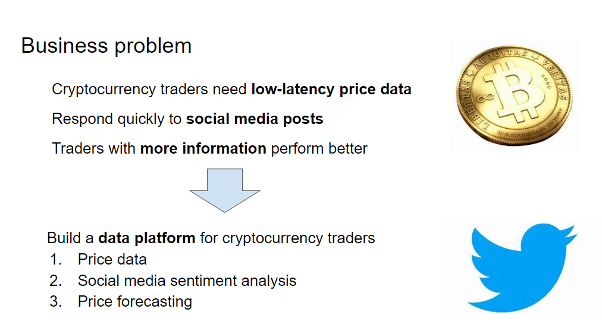
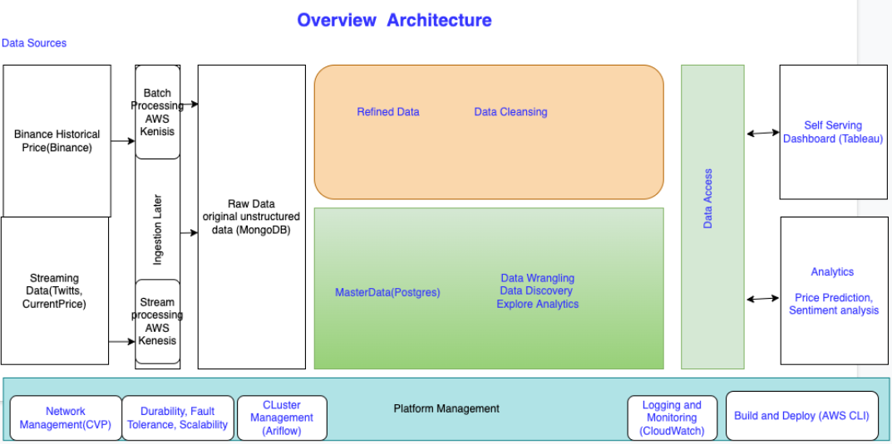

# crypto-data-prediction-model
A project to build a data platform to ingest, aggregate and analyze crypto price and social media sentiment about crypto

We focus on analyzing BTC price and social media sentiment.

## Contributors
Tay Yijun @tay-yijun  
Lim Xing Kang Norman @frenoid  
Joseph Zhou Weixin @joswx  
Tonay Aizize Abuduaini @Aibier

## Business problem

## Architecture

## Structure

### BTC price ingestion from Binance
[Price ingestion app](./streaming-service)

### BTC Post ingestion from Twitter 
[Twitter ingestion app](./twitter-service)

### Model to forecast 5 min ahead BTC price
[Price forecasting model](./price-forecasting)

### Model to analysis Twitter posts about BTC
[Sentiment analysis model](./sentiment-analysis)

### Presentation of data in a web app
[Data presentation app](./web-application)

