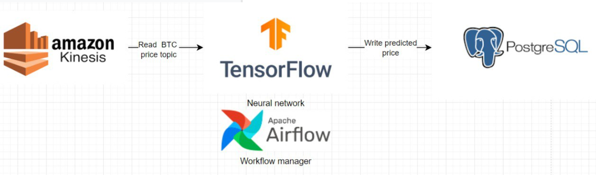

# Price forecasting model

This model reads the last 2 hours of BTC price data from Kinesis and predicts the 5-min price ahead price

It uses the Long Short Term memory model (LSTM) which is a kind of Recurrent Neural Network. 

RNNs have proven excellent at forecasting time-series data.

See this [tutorial](https://www.tensorflow.org/tutorials/structured_data/time_series) for reference

## Architecture
Source: Amazon Kinesis Stream

Modelling tool: Tensorflow

Workflow manager: Apache Airflow

Sink: PostgreSQL database




## Structure

[make_model.py](./make_model.py) trains the Tensorflow model and saves the model to [model](./model)

[make_forecast.py](./make_forecast.py) reads the pickled model and the last 2 hours of price to create forecast and writes the predicted price to PostgresSQL

[common.py](./common.py) contains a set of common functions used by the forecasting and modelling scripts

[requirements.txt](./requirements.txt) is a list of Python packages used in this model. Run ```pip install -r requirements.txt``` to install them.

[ddl](./ddl) contains DDL statements for Postgres tables

[airflow_dags](./airflow_dags) contains the Airflow DAGs used to schedule the models to run every 5min


## Model in action

A series of YouTube videos showing the model running live

[Training the model](https://www.youtube.com/watch?v=g5YC5c8cqpw&ab_channel=manofkrypton)

[Making a forecast](https://www.youtube.com/watch?v=6O_vXYIb2gA)

[Forecast data in Postgres](https://www.youtube.com/watch?v=VkJxAxnlqkM&ab_channel=manofkrypton)

[Deploying the model](https://www.youtube.com/watch?v=_ufd-dRiwnA&ab_channel=manofkrypton)


